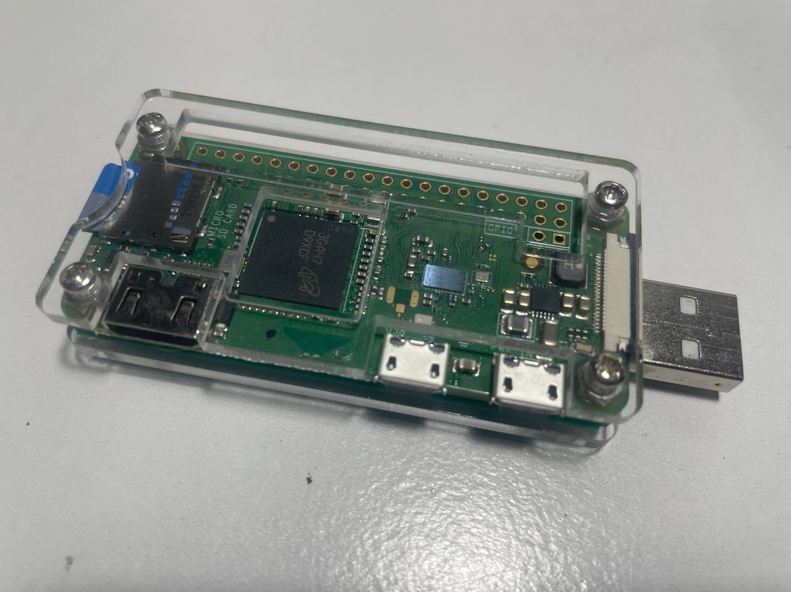
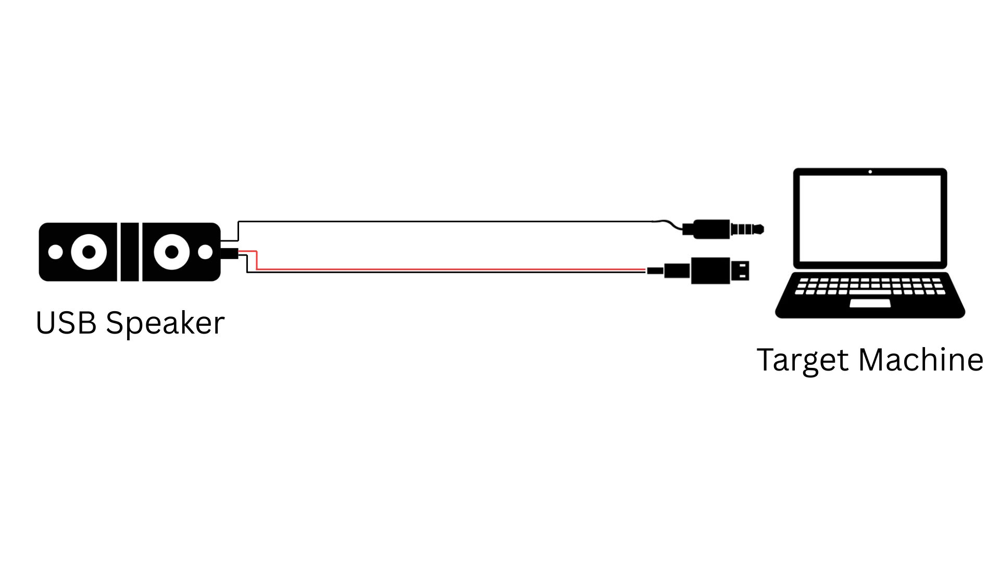
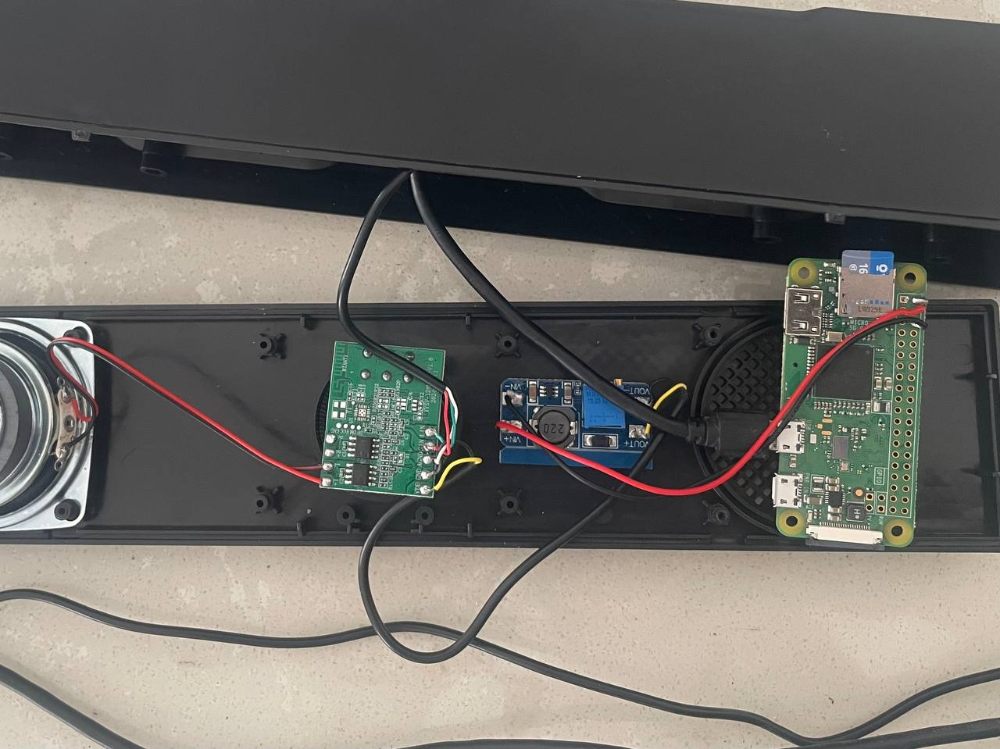
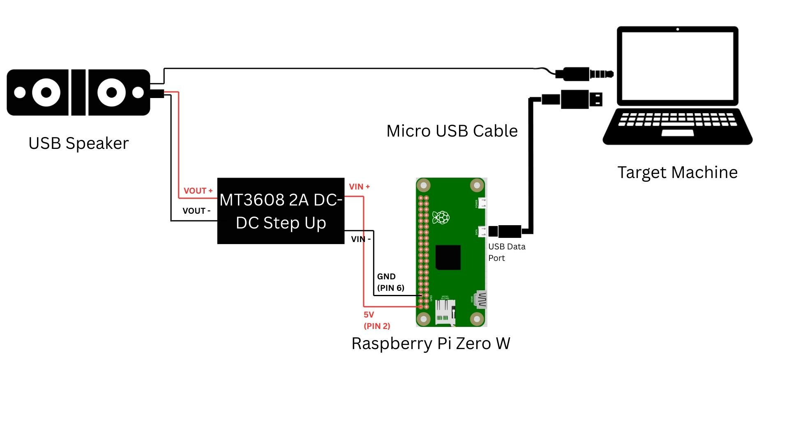

# P4wnP1 A.L.O.A-RPiZeroW - BadUSB Speaker

This project transforms a standard USB speaker into a powerful BadUSB device using a Raspberry Pi Zero W running P4wnP1 A.L.O.A. (A Little Offensive Appliance). While presented here in a speaker form factor, the core principles can be applied to other USB devices, including a standard USB stick, keyboard, or controller.

For a primer on what a BadUSB is and how it works, please refer to my previous [RubberDucky-RPiPico project](https://github.com/shdrzl7/RubberDucky-RPiPico).

Unlike traditional BadUSB devices that use pre-configured payloads, this project leverages a full Kali Linux environment on the Pi. This allows for remote payload execution via a web interface, offering greater flexibility and more advanced attack capabilities, all while being concealed within a functional USB speaker.

### 🧠 How Does It Work?

1.  **Device Connection & Boot-up**  
    When the USB speaker is plugged into a target machine, the Raspberry Pi Zero W boots up and automatically creates a Wi-Fi Access Point (AP).

2.  **Remote Access**  
    The attacker connects to the Pi's Wi-Fi network from a separate device (like a laptop or smartphone) and navigates to the P4wnP1 web interface.

3.  **Payload Execution**  
    From the web UI, the attacker can launch various HID keystroke injection attacks, run custom scripts, and execute advanced payloads remotely. All the while, the device continues to function as a normal USB speaker, making it highly inconspicuous.

4.  **Outcome**  
    Within seconds, an attacker can:
    -   Run PowerShell scripts
    -   Install backdoors or exfiltrate data
    -   Disable security controls
    -   Perform post-exploitation and credential harvesting

## ⚠️ Disclaimer
This project is for educational and authorized testing purposes only. Misuse of this tool can cause significant damage and is illegal. Always obtain explicit permission before using such tools in any environment.

## 💻 Requirements
<table>
  <tr>
    <td align="center">
      <strong>Raspberry Pi Zero W</strong> RM82.50 
      
    </td>
    <td align="center">
      <strong>16GB SD Card</strong> RM15.40 
      <!-- No image for this item -->
    </td>
    <td align="center">
      <strong>MT3608 2A DC-DC Step Up</strong> RM2.33 
      
    </td>
    <td align="center">
      <strong>Micro USB Cable</strong> RM15.40 
      <!-- No image for this item -->
    </td>
    <td align="center">
      <strong>Jumper Wires</strong> 
      <!-- No image for this item -->
    </td>
     <td align="center">
      <strong>Wired USB Speaker</strong> RM29.21 
      
    </td>
  </tr>

</table>

### 🔌 Alternative Form Factor: Standard USB Stick

If a speaker form factor is not desired, this project can easily be adapted to a standard USB stick form factor. This requires a **Pi Zero W USB-A Addon Board** (RM18.90), which allows the Raspberry Pi Zero W to directly plug into a USB-A port. This setup allows the device to appear as a typical USB drive or other HID device (keyboard, mouse) without the speaker disguise, offering flexibility for various attack scenarios.

You can integrate the Raspberry Pi Zero W and the addon board into any suitable USB enclosure.

*Note: This image is an example of the project in a USB stick form factor. Your final build may vary.*

## 📂 Project Structure
- `Payloads/` - HID scripts in JavaScript for P4wnP1.
- `UI Navigation/` - Screenshots and guides for navigating the P4wnP1 web interface.

## Wiring / Circuit Diagram
A typical wired USB speaker is powered directly by the USB port it's plugged into.

To intercept this, we will modify the circuit. The USB-A plug that connects to the target machine will now power and provide a data connection to the Raspberry Pi. The Pi will then power the original speaker's amplifier circuit via a DC-DC step-up converter. The step-up converter is necessary to ensure the speaker functions correctly with its original components.

**Important:** The Micro-USB cable from the speaker's original cable must be connected to the Pi Zero's **USB data port** (the one closer to the center of the board), not the PWR (power) port. This is crucial for the BadUSB functionality to work.

### Raspberry Pi Zero W Pinout
Here is the pin layout for the Raspberry Pi Zero W for reference. We will be using Pin 2 (5V) and Pin 6 (GND).

### Connections
The physical connections should be made as follows:

- **Raspberry Pi to Step-Up Converter:**
    - Connect Pi Zero **Pin 2 (5V)** to the **VIN+** pad on the DC-DC Step-Up converter.
    - Connect Pi Zero **Pin 6 (GND)** to the **VIN-** pad on the DC-DC Step-Up converter.
- **Step-Up Converter to Speaker:**
    - Connect the **VOUT+** pad on the DC-DC Step-Up converter to the speaker's power wire (usually red).
    - Connect the **VOUT-** pad on the DC-DC Step-Up converter to the speaker's ground wire (usually black).

## 🧰 Setup / Installation

1.  Download the image file `P4wnP1-aloha-kali-linux-2023.1-raspberry-pi-zero-w-by-NightRang3r-1.1.2.img.xz` [here.]([https://www.raspberrypi.com/software/](https://drive.google.com/drive/folders/14XCb1sHFjzZa7OnzNZRt5AeTbEyZlZGf)  
2.  Plug in the 16GB SD card to your computer using an SD card reader.
3.  Flash the SD card with the downloaded image file using software like [Raspberry Pi Imager](https://www.raspberrypi.com/software/) or [balenaEtcher](https://www.balena.io/etcher/).
4.  Once flashing is complete, safely eject the card reader and insert the SD card into the Raspberry Pi Zero W.
5.  Assemble the circuit as shown in the wiring diagram.

## 🛠️ How to Use

### Connecting to the Device
1.  Plug the device's USB-A plug into your target machine.
2.  Wait for approximately one minute for the Pi to boot.
3.  On your attacking machine (laptop or smartphone), scan for Wi-Fi networks and connect to the following AP:
    -   **SSID:** 💥🖥💥 Ⓟ➃ⓌⓃ🅟❶
    -   **Password:** MaMe82-P4wnP1

### Accessing the Web UI
1.  Once connected to the Wi-Fi, open a web browser on your attacking machine.
2.  Navigate to **http://172.24.0.1**.
3.  You can now use the P4wnP1 web interface to execute HID attacks. For a detailed guide on the UI, refer to the `UI Navigation/` folder.

## Related Projects
1.  **Create a Bad USB using Raspberry Pi Pico**  
    https://github.com/shdrzl7/RubberDucky-RPiPico
