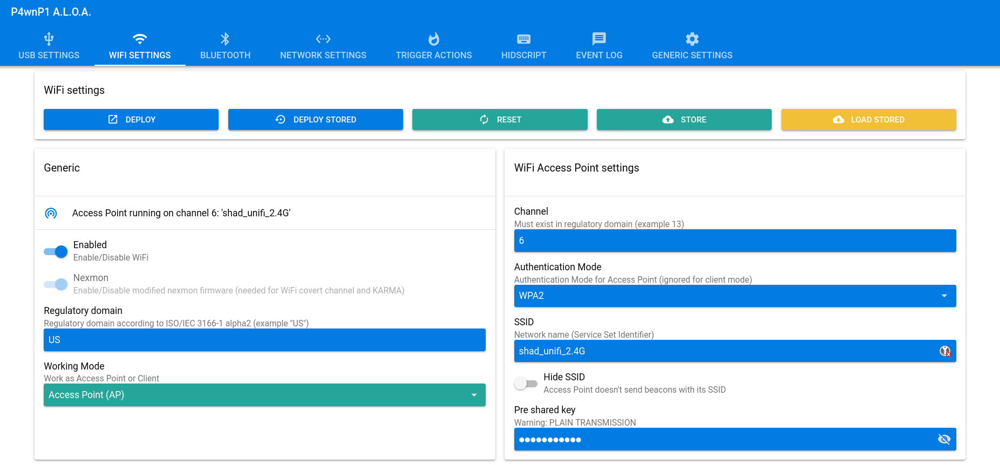
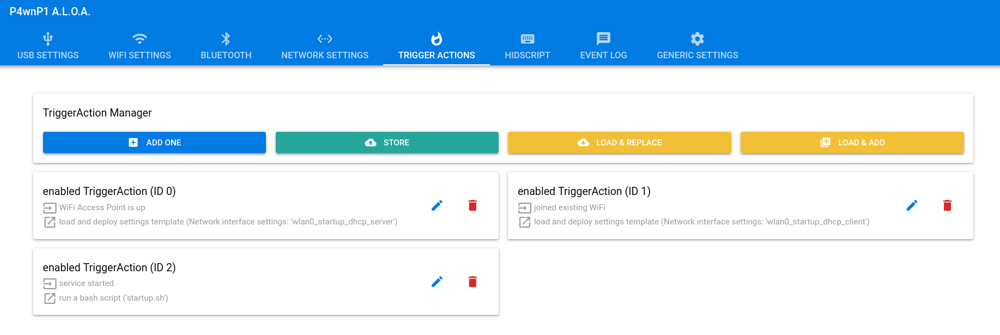
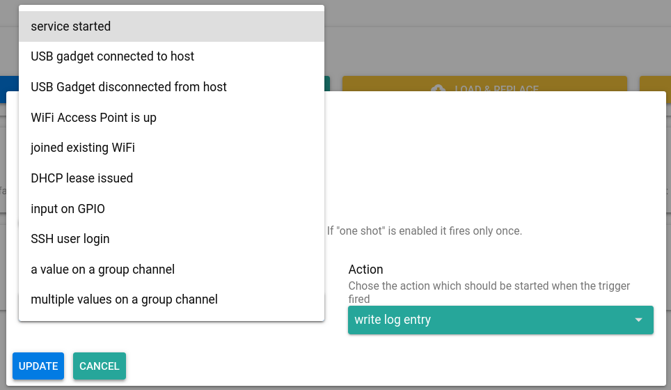
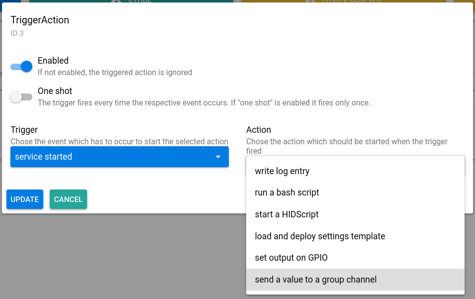
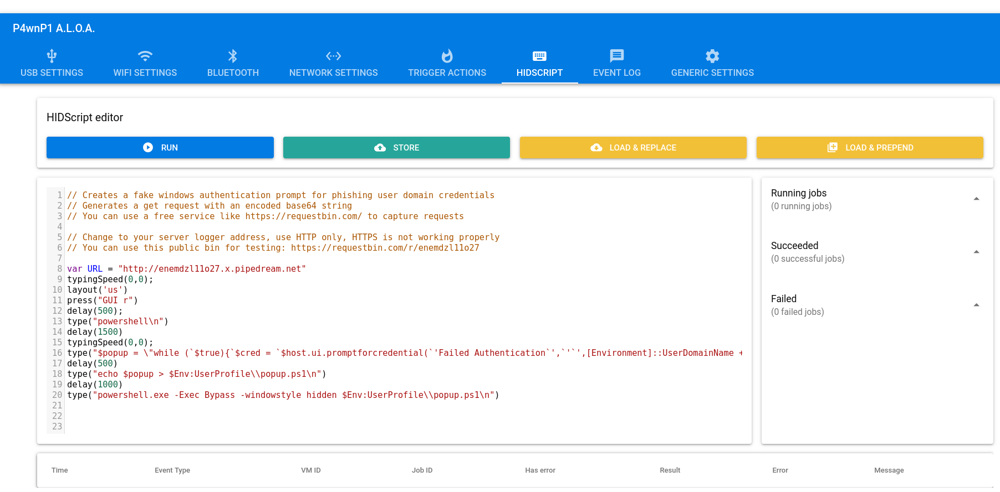
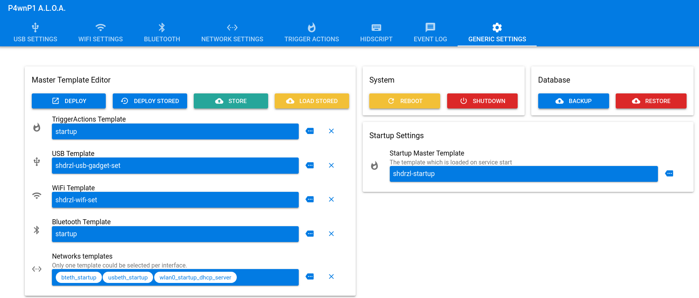

# P4wnP1 A.L.O.A. Web UI Navigation Guide

This document provides a guide to navigating the P4wnP1 A.L.O.A. web interface. It covers the essential configuration tabs for customizing the BadUSB's behavior.

After connecting to the P4wnP1's Wi-Fi and navigating to `http://172.24.0.1:8000`, the web UI is presented. This guide focuses on the critical sections required for attack configuration.

---

### Common Configuration Buttons

Most configuration tabs include a standard set of buttons for managing settings:

-   **Deploy:** Applies the current, temporary configuration changes to the running P4wnP1 instance. These changes are not saved permanently and will be lost on reboot.
-   **Store:** Saves the current configuration to a named profile on the device.
-   **Load Stored:** Loads a previously saved configuration profile.
-   **Deploy Stored:** Selects a saved configuration profile and deploys it immediately.
-   **Reset:** Resets the configuration on the current tab to its default values.

---

### Key Configuration Tabs

#### 1. USB Settings

This tab is used to define how the P4wnP1 device appears to the target host. An incorrect USB profile can prevent HIDScripts from executing correctly.

-   **USB Gadget:** The right panel allows selection of the USB gadget type P4wnP1 will impersonate (e.g., Keyboard, Mouse, Mass Storage). Certain HIDScripts require a specific gadget type.

For details on creating custom flash drive images, refer to the guide: [Custom Flash Drive Image Guide](../others).

-   **Device Identifiers:** The left panel is for modifying the device's USB identifiers to mask it as a legitimate product. These include:
    -   Manufacturer Name
    -   Product Name
    -   Serial Number

#### 2. Wi-Fi Settings

This tab is for configuring the Wi-Fi Access Point (AP) broadcast by P4wnP1.

The default SSID (`💥🖥💥 Ⓟ➃ⓌⓃ🅟❶`) and password (`MaMe82-P4wnP1`) are conspicuous. It is recommended to change these to less suspicious values to avoid detection (e.g., "Free-Wifi", "HP-Printer-Setup", "Unifi_2.4G").

#### 3. Trigger Actions

This section allows for the automation of actions based on defined conditions or events. To create a new automation, click **"Add one"**.

A trigger and a corresponding action can then be defined.

-   **Available Triggers include:**
    
    -   `USB gadget connected to host` (when the USB is plugged in)
    -   `service started` (on boot)
-   **Available Actions include:**
    
    -   `start a HIDScript`
    -   `run a bash script`

**Example:** A trigger can be configured to execute a specific `HIDScript` when P4wnP1 connects to a host machine (`USB gadget connected to host` trigger).

#### 4. HIDScript

This section is for managing HIDScripts, which are JavaScript-based payloads for executing keystroke injection attacks.

From here, it is possible to:
-   Create a new script.
-   Load and modify pre-existing scripts.
-   Upload custom scripts.
-   See the status of the running script (Succeed / Failed).

#### 5. Generic Settings

This tab is used to create a master template that consolidates all individual settings (USB, Wi-Fi, Triggers, etc.) into a single profile.

After configuring the settings in other tabs, the Generic Settings tab can be used to:
-   Save the entire configuration as a single master template.
-   Set the master template to be deployed automatically on startup.
